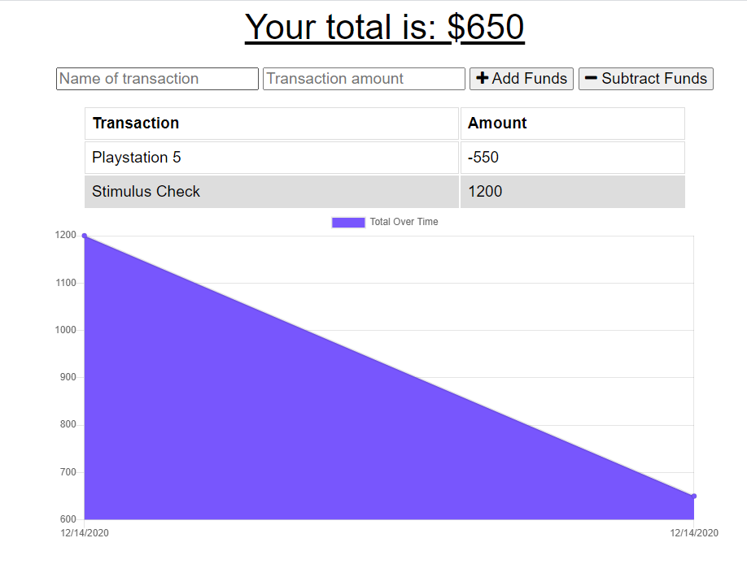

# Online/Offline Budget Trackers

## Table of Contents
1. [ Description ](#desc)
2. [ Features ](#features)
3. [ Usage ](#usage)
4. [ Questions ](#quest)
    

## 1. Description
This application is supposed to allows users to keep track of their budget and allows a user to enter transactions while offline.

This application stores user data in MongoDB Atlas while online, but it can be run locally without an internet connection (as well as being installed as a PWA) and store transactions in the browser's IndexedDB. When internet connection is back on, those transactions stored in IndexedDB will be sent to MongoDB, and future output will include those transactions while made offline.

## Features

* Node.js back end with Express routing. 
* Manifest.json and service-worker.js provide PWA functionality.
* MongoDB/Mongoose stores and retrieves transactions while online. 
* While offline, IndexedDB keeps track of transactions.
* Chart.js library provides tools needed for data charts.

    

## 3. Usage
Enter in the name and amount of the transaction and and decide wether the transaction is a Deposit or a Withdrawl. Each transaction will be logged and a chart showing you the flow of your budget will be provided.
 
<h3>Budget Tracker</h3>

 

## 4. Questions
Please visit my GitHub to view all of my work:
https://www.github.com/bbrintle 

Check out the site:
https://floating-fjord-65617.herokuapp.com/

Contact me at: bbrintle@gmail.com